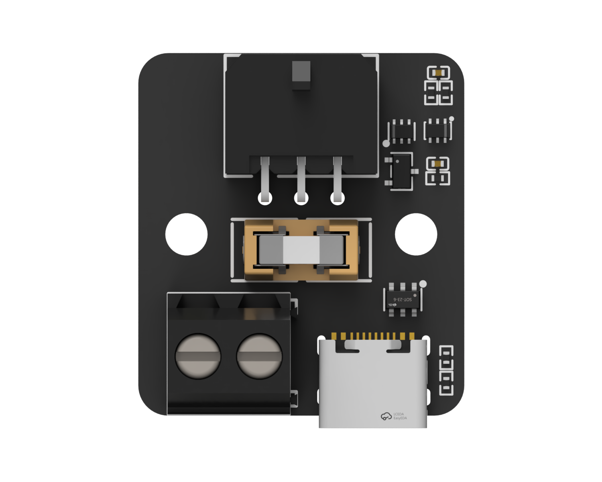

# USB Toolhead Adapter
A simple 3D printer PCB designed to sit between a USB toolhead board and a SBC, with protection for the SBC. Uses the same protection topology found on [Birds' Nest (USB)](https://github.com/xbst/Birds-Nest)

## Pinout

[Pinout](https://docs.isiks.tech/pinouts/usb-adapter/usb-adapter.pinout.html)

## Purchasing

[Isik's Tech Store](https://store.isiks.tech/products/usb-adapter)
